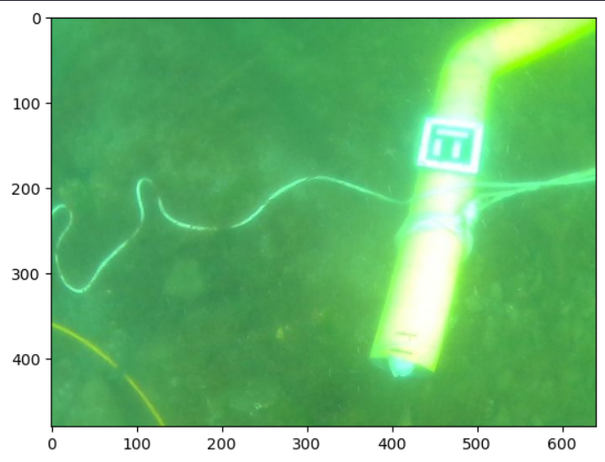
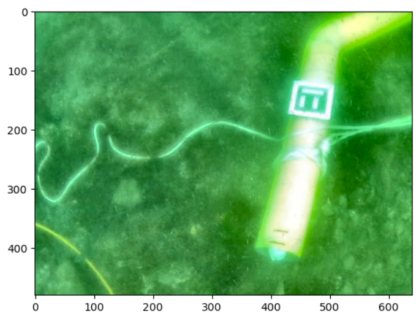
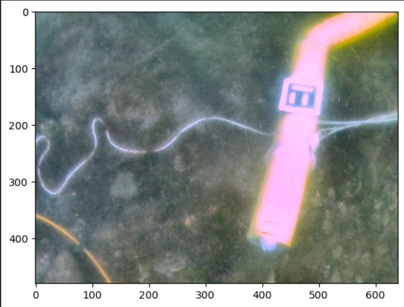

# Underwater Image Enhancement using Reinforcement Learning

This project focuses on enhancing underwater images using reinforcement learning algorithms, including Q-learning and the REINFORCE algorithm. By applying techniques such as White Balancing, Contrast Adjustment, Brightness Modification, and CLAHE (Contrast Limited Adaptive Histogram Equalization), the system improves the quality of underwater images, optimizing them for feature detection and analysis.

## Implement
To train and visualise the results of the Q_learning Algorithm, use the following notebook:
```Q_Learning.ipynb```

To train and visualise the results of the Reinforce Policy Gradient Algorithm, use the following notebooks:
```Reinforce_Policy_Gradient.ipynb``` or ```Pytorch_Reinforce_Policy_Gradient.ipynb```

## Results
 
### Original Image
   

### Q Learning Enhanced Image
  
Q Learning Enhanced Image  

### Reinforce Enhanced Image
   


